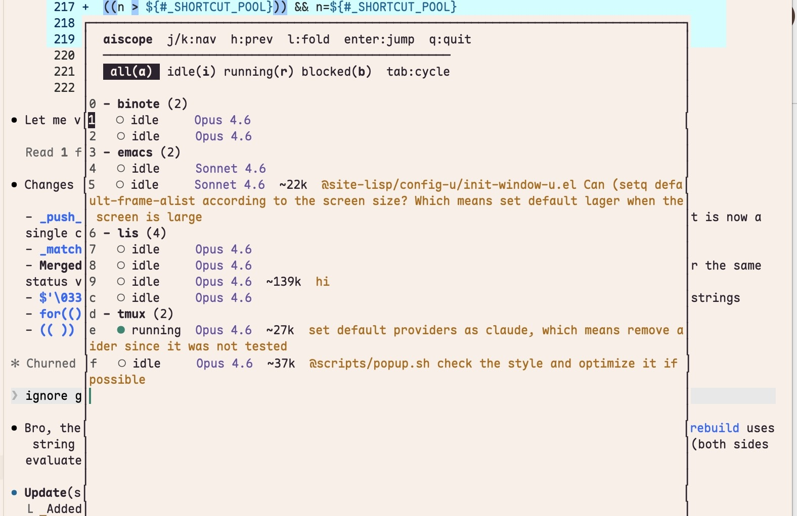

# tmux-aiscope

A tmux plugin that shows a popup listing all AI sessions across windows — like `prefix-s` but for AI CLIs.

Press `prefix + a` → pick a pane → jumps straight to it.



## Requirements

- tmux ≥ 3.2
- bash ≥ 4.0 (`brew install bash` on macOS)

## Install

**TPM (recommended)**

```bash
set -g @plugin 'Guxi11/tmux-aiscope'
```

Then `prefix + I` to install.

**Manual**

```bash
git clone https://github.com/Guxi11/tmux-aiscope ~/.tmux/plugins/tmux-aiscope
```

Add to `~/.tmux.conf`:

```bash
run-shell ~/.tmux/plugins/tmux-aiscope/tmux-aiscope.tmux
```

## Configuration

```bash
set -g @aiscope-key          'a'    # keybinding (default: a)
set -g @aiscope-popup-size   '80%'  # popup dimensions (default: 80%)
```

## Supported Providers

| Tool | Model detection | Token count |
|------|----------------|-------------|
| Claude Code | pane capture + `~/.claude/` JSONL | ✓ |

## Keybindings (inside popup)

| Key | Action |
|-----|--------|
| `Enter` | Jump to selected pane |
| `j` / `↓` | Move down |
| `k` / `↑` | Move up |
| `h` | Previous session |
| `l` | Fold/unfold session |
| `Tab` | Cycle filter |
| `a` `i` `r` `b` | Filter: all / idle / running / blocked |
| `0-9` | Shortcut jump |
| `q` / `Esc` | Close |

## License

MIT
